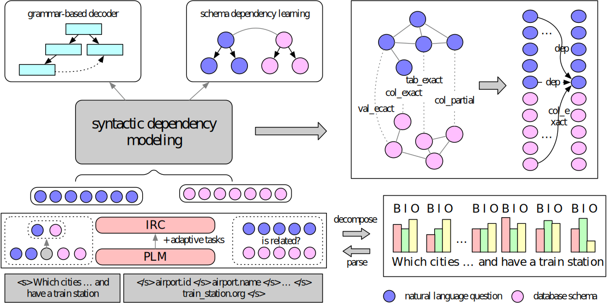

<!--
 * @Author: RainbowCatSzy
 * @Date: 2023-06-23 23:04:36
 * @LastEditors: RainbowCatSzy
 * @LastEditTime: 2023-06-23 23:05:29
-->
# ACQD: Annotation-based Complex Query Decomposition Model Enhanced by Table Pre-training for NL2SQL #

This is the official codebase of the paper

## Overview ##
The main idea of ACQD is to alleviate the difficulty of encoding and decoding procedures in NL2SQL by decomposing a complex question into multiple simple questions, then using decoding results of simple questions to recover the result of original complex question. ACQD is consist of five modules: Intermediate Representation Completion framework (IRC), complex query decomposition, syntactic dependency modeling, grammar-based decoder and schema dependency learning. 


This codebase is based on PyTorch. It supports training and inference with multiple GPUs or multiple machines.

## Installation ##
You may install the dependencies via either conda or pip. Generally, ACQD works
with Python 3.7/3.8 and PyTorch version >= 1.8.0.

Please run as follows to install all the dependencies:

```
pip3 install -r requirements.txt
```

## IRC ##
Please go to folder IRC to see details of pre-training and evaluating of IRC. 

## Statement ##
These codes are about IRC of ACQD. More codes about ACQD are preparing, and we will upload it as soon as we can.

## Thanks ##
These codes is modified by grappa. Thanks for taoyus's contribution.
